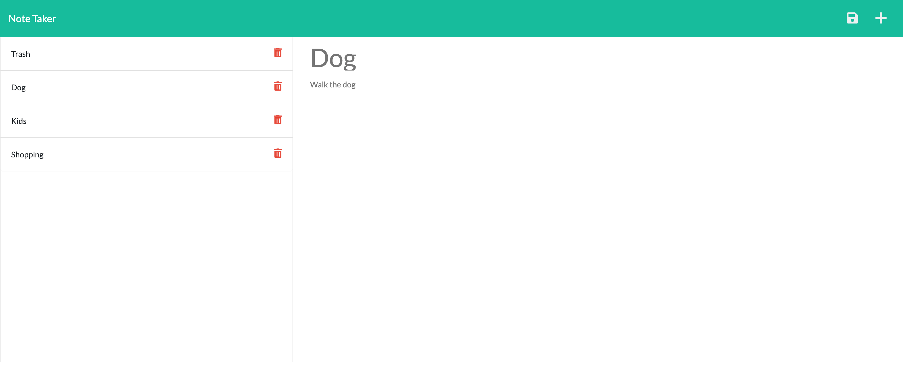

# Note Taker

## Description

Use this Note Taker to organize your thoughts and keep track of any tasks that you need to complete! This is an easy to use application that will allow you to save multiple notes into a data base to be accessed at a later time. If you are finished with a note, just hit the delete button and it will erase it from the data base.

[Link to Deployed Application]()

---

## Table of Contents

- [Screenshot](#screenshot)
- [Installation](#installation)
- [License](#license)
- [Questions](#questions)

---

## Screenshot

---

## Installation

To install the necessary dependancies, run the following command:

npm i

---

## License

none

---

## Questions

Contact me with any questions about the repo or report any issues at eebbinghaus@gmail.com

Find more of my projects at my GitHub: [eebbinghaus](https://github.com/eebbinghaus)
